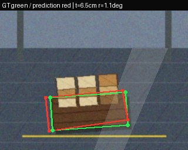
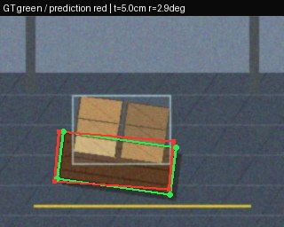
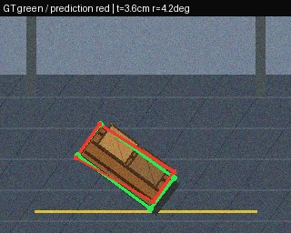

# Pallet Audit: Pose Estimation and Load Compliance

A fail-safe reference implementation for the Delhivery Computer Vision assignment. It converts four ordered pallet floor-corner keypoints and monocular load evidence into metric floor pose, uncertainty, eight SOP decisions, and an auditable overall verdict.

The research-backed model selection, paper comparison, and experiment gates are in [docs/RESEARCH_AND_MODEL_SELECTION.md](docs/RESEARCH_AND_MODEL_SELECTION.md).

> **Submission status:** the geometry, output contract, versioned synthetic dataset, trained synthetic pose and load-segmentation weights, evaluation, sensitivity tooling, and tests are implemented. Real warehouse data, physical calibration images, production-qualified damage inference, Jetson measurements and the screen recording remain unavailable. Synthetic results are clearly scoped and are never presented as warehouse performance.

## Quick start

```bash
python -m venv .venv
.venv/Scripts/activate
pip install -e ".[dev]"
python -m pallet_audit.cli examples/request.json -o assessment.json
python -m unittest discover -s tests -v
python tools/generate_synthetic.py --count 100
python tools/run_trained_pipeline.py data/pallet_pose/images/test -o assessments
```

Install `.[vision]` only for camera calibration and YOLO pose training. The package itself requires only NumPy and Pillow.

Research baseline training and export:

```bash
python tools/coco_to_yolo_pose.py annotations.json images data/pallet_pose
python tools/train_models.py pose --model yolo11s-pose.pt --data configs/pallet_pose.yaml
python tools/train_models.py segment --model yolo11n-seg.pt --data configs/load_seg.yaml
python tools/export_models.py runs/pose-yolo11s-pose/weights/best.pt --format engine
```

## 1. Approach and significant decisions

| Decision | Benefit | Cost accepted |
|---|---|---|
| Generate a licensed synthetic baseline | Reproducible labels, exact geometry, no copyright ambiguity | Large reality gap; no warehouse accuracy claim |
| Predict four ordered floor corners | Directed face identity and metric footprint instead of an ambiguous box centre | More annotation effort and sensitivity to occlusion |
| Use a surveyed floor homography | Identifiable metric scale for a fixed camera without learned depth | A camera/mount change requires recalibration |
| Start with YOLO11n pose/segmentation | Trainable on available compute and compatible with edge export | Lower capacity; class-wise validation rejects several SOP outputs |
| Fail safe on missing evidence | Prevents hidden damage or weak masks from becoming a false pass | Lower automation rate; all current end-to-end samples require review |

### Detection and localization

The proposed production detector is a YOLO pose model with one `pallet` class and four ordered floor-contact keypoints: front-left, front-right, back-right, back-left. A box-only detector was rejected because a rectangle centre does not identify the pallet's labelled front face or give a stable floor-plane footprint. Instance segmentation may improve occlusion handling but costs annotation time and Jetson latency.

The dataset must combine licensed public pallet imagery, staged local captures from the target camera family, and hard-negative warehouse scenes. Public data supplies appearance diversity; staged captures supply the fixed-camera geometry and metric ground truth. Synthetic images generated by `tools/generate_synthetic.py` test I/O only and are excluded from reported accuracy. See [DATASET.md](DATASET.md).

### Metric pose

Camera intrinsics are estimated with a ChArUco calibration board. A surveyed set of floor points provides the image-to-floor homography. Four detected floor corners are projected into metres; their centroid is `(x, y)` and the labelled front-left to front-right vector defines directed orientation. This distinguishes 30 degrees from 45 degrees and removes the otherwise unresolved 180-degree ambiguity.

Finite-difference perturbation propagates pixel localization and calibration error into `sigma_x`, `sigma_y`, and `sigma_theta`. A pose is rejected when any corner confidence is below 0.5, position uncertainty exceeds 2 cm, or orientation uncertainty exceeds 3 degrees. In production, these thresholds must be selected on calibration data rather than treated as proof of accuracy.

### SOP analysis

The camera sees one side; therefore absence of visible damage is not proof of no damage. The implemented interface accepts detector/segmenter evidence and applies these observability rules:

| SOP | Observability | Implementation and limitation |
|---|---|---|
| 1. Overhang <=3 cm | Partial | Visible footprint against projected pallet polygon; hidden rear edge requires another view. |
| 2. Height <=1.8 m | Partial | Floor-to-top metric estimate; sensitive to calibration and occluded top. |
| 3. Columns <=15 degrees | Partial | Visible box edge orientations relative to pallet axes. |
| 4. Large below small | Partial | Visible box instances only; always manual in the MVP. |
| 5. Stretch wrap | Verifiable when visible | Binary classifier probability; glare and transparent film lower confidence. |
| 6. No damaged box | Partial | Positive visible damage can fail; a negative single view remains manual. |
| 7. Centroid within 10 cm | Partial | Visible load mask centroid; rear depth is inferred. |
| 8. Pallet undamaged | Partial | Positive visible damage can fail; hidden boards remain manual. |

Any reliable high-confidence failure produces `fail`. Otherwise any unverified/low-confidence check produces `manual_inspection`. `pass` is intentionally rare and requires all checks to be observably supported.

Pose confidence is the minimum of the four keypoint confidences. Evidence
visibility is the minimum pose detection and keypoint confidence. Observable
appearance checks use that value; metric checks also require a reliable pose and
are down-weighted to 35% when pose uncertainty fails. A missing measurement or
confidence below 0.5 becomes manual inspection. Only a supported failure with
confidence at least 0.6 can dominate the overall verdict. Damage non-detections
remain manual because a one-sided view cannot prove an undamaged hidden surface.

### Output contract

Every assessment contains metric pose and uncertainty, per-check measurement/confidence/reason, overall verdict, reasons, timestamp, and model version. See [schemas/assessment.schema.json](schemas/assessment.schema.json) and [examples/request.json](examples/request.json). This provenance allows a disputed assessment to be replayed against the same model and evidence.

## 2. Results

No warehouse test set was supplied or captured, so no real-world accuracy is claimed. Reporting invented AP or pose error would violate the assignment's central requirement. A YOLO11n pose model was fine-tuned on the committed `synthetic-v1` dataset and evaluated on a shifted synthetic test domain:

| Held-out synthetic-v1 metric | Result |
|---|---:|
| Detection recall | 100% |
| Box mAP50-95 | 0.966 |
| Pose mAP50-95 | 0.995 |
| Translation error p50 / p95 | 2.10 cm / 4.79 cm |
| Rotation error p50 / p95 | 1.41 deg / 3.68 deg |
| Joint 2 cm / 3 deg success | 40.0% |

The weight is `weights/pallet_pose_yolo11n_synthetic_v1.pt`; complete provenance and distributions are in `reports/pose_model/`. The result demonstrates why OKS/AP cannot replace metric pose evaluation: the model does **not** clear the assignment bar on most shifted-domain samples.

A YOLO11n-seg baseline was also fine-tuned on all 240 synthetic training images
and tested on the 60 shifted images. Its aggregate mask mAP50-95 is 0.197. The
model learned pallet masks (0.709) and a moderate box mask baseline (0.464), but
load masks (0.006), wrap masks (0.000), and both damage classes (0.000) are not
operational. The committed weight is
`weights/load_seg_yolo11n_synthetic_v1.pt`; the complete class-wise result and
provenance are in `reports/load_seg_model/`. Missing damage detections remain
`manual_inspection`, never a pass.

The two checkpoints are connected to the complete assessment path in
`tools/run_trained_pipeline.py`. On all 60 shifted test images it emitted one
schema-valid assessment per pallet: all 60 correctly route to
`manual_inspection` because the validated evidence cannot support an overall
pass. The validation gate also caught that raw box-mask angles would falsely
fail 46/60 known-aligned scenes; those values are retained as diagnostics but
are excluded from decisions. See `reports/end_to_end/`.

Deployment benchmarking used 20 warm-up plus 1,000 timed CPU iterations per
model at 256 pixels, batch 1, and the runtime 0.05 confidence threshold. Pose
measured 63.1 ms p50 / 88.6 ms p95 (15.46 FPS mean); segmentation measured 62.2
ms / 99.6 ms (14.85 FPS). The documented every-third-frame segmentation cadence
is approximately 11.48 FPS from measured mean service times, so it fails the 15
FPS gate on this CPU. No Jetson or
quantization result is claimed; see `reports/deployment/`.

Distribution tooling remains executable for future real records:

```bash
python tools/evaluate_pose.py evaluation_records.json -o pose_metrics.json
python tools/sensitivity.py -o sensitivity.json
```

`evaluate_pose.py` reports sample count, abstention rate, translation-error p50/p90/p95/p99, rotation-error p50/p90/p95/p99, and joint pass rate at 2 cm/3 degrees. Detector evaluation should separately report box mAP50-95 and keypoint OKS/AP plus per-keypoint pixel-error distributions. Split by **physical scene/capture session**, never random frames, to prevent adjacent-frame leakage.

The acceptance gate is the joint held-out rate, stratified by range (0-2, 2-4, >4 m), yaw, occlusion, lighting, and pallet type. The usable envelope is the connected range/view-angle region where the one-sided 95% upper confidence bound clears both tolerances. Outside it the runtime must abstain.

## 3. Failure analysis

The three actual worst cases from the shifted synthetic held-out split are:

1. **Glare-driven coherent shift:** 6.5 cm / 1.1 deg. All four corners move together under the test glare/palette shift, so confidence does not reveal the metric bias. 
2. **Wrap/load edge competition:** 5.0 cm / 2.9 deg. The bright load outline competes with the pallet rear edge and expands the footprint. 
3. **Shallow apparent depth:** 3.6 cm / 4.2 deg. Asymmetric rear-corner error produces a large angle change. 

Exact errors and predictions are committed in `reports/pose_model/`. Real warehouse worst cases must still replace or accompany these synthetic examples after capture.

## 4. What could not be finished and why

- Real dataset and production weights: synthetic pose and segmentation checkpoints are included, but target-scene capture is essential for operational evaluation.
- Calibration artefacts/reprojection error: requires the physical camera and board images. The repository defines the required process in [docs/CALIBRATION.md](docs/CALIBRATION.md).
- Production SOP vision: the synthetic segmenter provides an inspectable baseline, but its class-wise test result rejects load/wrap masks and damage inference. The assessment logic safely abstains for unsupported evidence.
- Jetson Orin Nano latency/quantization: no target hardware or exported weights were available. No third-party benchmark is presented as measured performance.
- Five-minute recording: it requires the final trained run and the submitter's narration.

This is a finished, honest geometry-first MVP rather than an unverified end-to-end claim.

## 5. AI tool usage

OpenAI Codex was used to interpret the brief, scaffold the Python package, write tests, and draft documentation. All geometric assumptions and safety thresholds are exposed for review. One AI-generated issue caught during review was the temptation to treat a low damage probability as a pass; this is invalid from a single view, so negative damage observations are returned as `manual_inspection`.

## Training and evaluation plan

1. Collect and license imagery following `DATASET.md`; calibrate with `docs/CALIBRATION.md`.
2. Annotate ordered corners and attributes; perform double-label QA on 10%.
3. Convert COCO keypoints to the selected trainer format; train small and nano pose variants at fixed resolution.
4. Select by keypoint localization distribution and end-to-end metric pose, not detector mAP alone.
5. Export ONNX then TensorRT FP16. Compare FP32/FP16 (and INT8 only with a representative calibration set) on the same held-out records.
6. Measure end-to-end latency on the actual device with warm-up, synchronization, batch=1, and p50/p95 over at least 1,000 frames.

## Architecture

```text
image -> pallet/box/keypoint models -> calibrated floor projection
      -> pose + propagated uncertainty -> SOP evidence + confidence
      -> fail-safe policy -> versioned JSON assessment
```

## Repository map

- `src/pallet_audit/`: geometry, uncertainty, compliance policy, data models, CLI
- `tools/`: synthetic fixtures, distribution evaluation, sensitivity analysis
- `tests/`: geometry and fail-safe policy tests
- `schemas/`: versioned assessment contract
- `docs/`: calibration and deployment protocols
- `DATASET.md`: sourcing, splitting, annotation policy, biases

The operational capture-to-export checklist is in [docs/DATA_COLLECTION_RUNBOOK.md](docs/DATA_COLLECTION_RUNBOOK.md).
The exact five-minute demonstration is in [docs/RECORDING_SCRIPT.md](docs/RECORDING_SCRIPT.md),
and final artefact/external-evidence status is in
[docs/SUBMISSION_CHECKLIST.md](docs/SUBMISSION_CHECKLIST.md).

## License and citations

Code is provided under the MIT license. Candidate model stack: [Ultralytics YOLO pose documentation](https://docs.ultralytics.com/tasks/pose/), [OpenCV camera calibration documentation](https://docs.opencv.org/4.x/dc/dbb/tutorial_py_calibration.html), and [COCO keypoint format](https://cocodataset.org/#format-data). Dataset licenses must be recorded per image before distribution.
